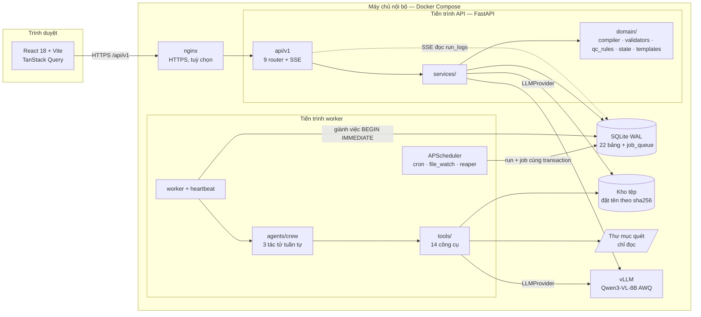
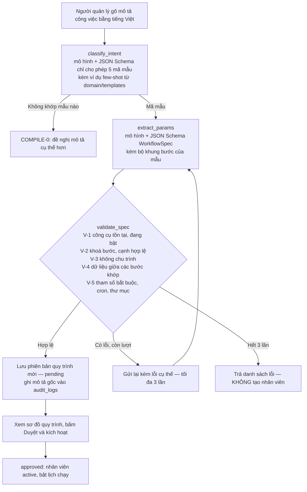
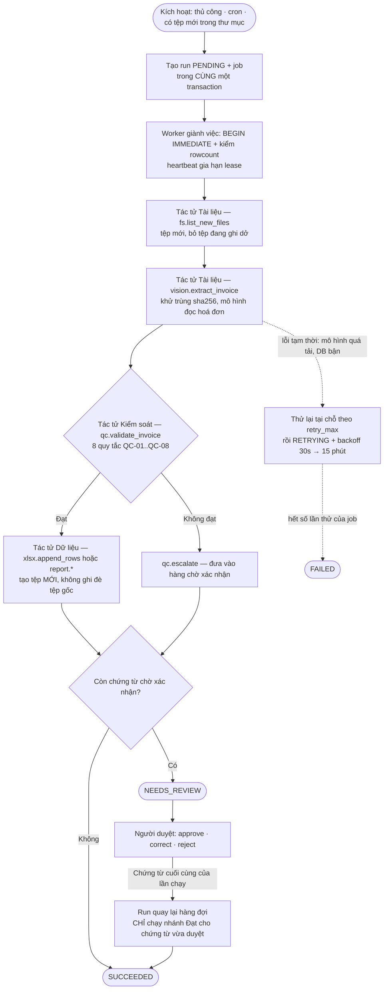
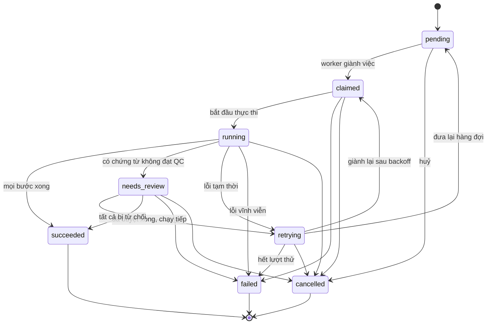
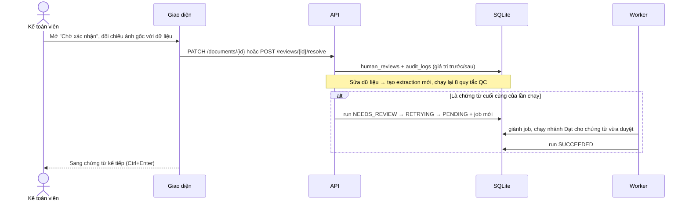
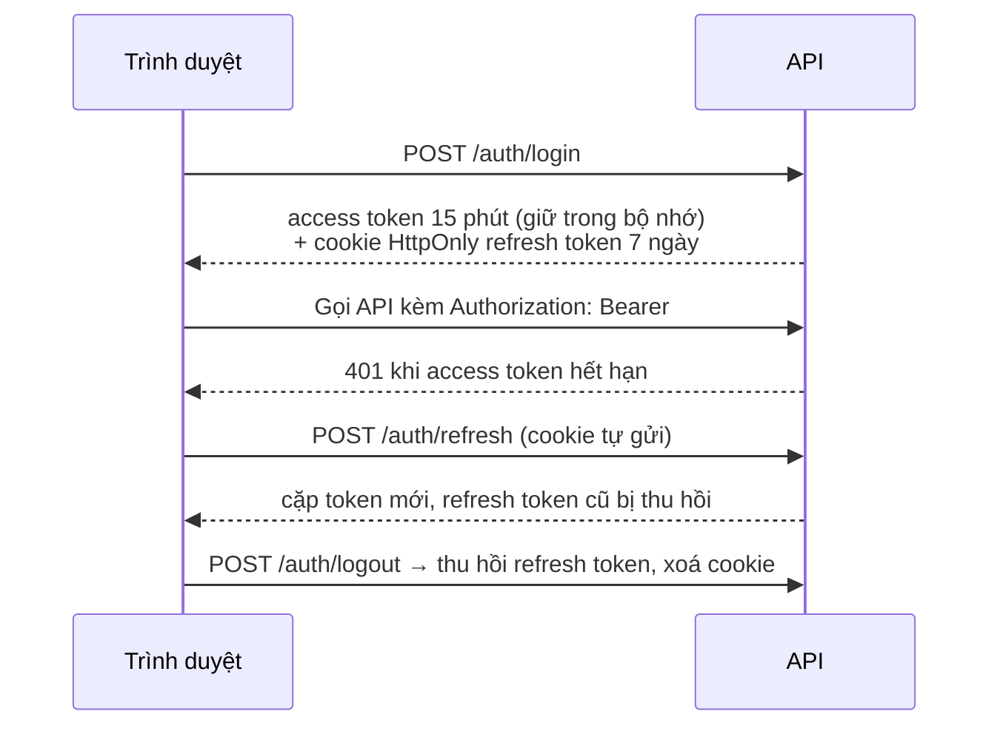

# SME AI Workforce

Nền tảng tạo và vận hành **nhân viên AI** cho doanh nghiệp nhỏ và vừa (SME) Việt Nam.
Người dùng mô tả công việc bằng tiếng Việt → hệ thống biên dịch thành một **quy trình xử lý
chứng từ** (đọc hoá đơn, ghi Excel, lập báo cáo, làm sạch/đối chiếu bảng tính, phân loại tài
liệu) → chạy tự động theo lịch → kiểm tra bằng **8 quy tắc QC** → chứng từ nghi ngờ được chuyển
cho **người xác nhận** trước khi đi tiếp. Chạy **100% nội bộ, không cần Internet** khi dùng dữ liệu thật.

**Mục lục:** [Công nghệ](#1-công-nghệ-sử-dụng) · [Kiến trúc](#2-kiến-trúc-hệ-thống) ·
[Lưu đồ](#3-lưu-đồ-nghiệp-vụ) · [Workflow gồm những gì](#4-workflow-của-hệ-thống-gồm-những-gì) ·
[Lựa chọn model](#5-lựa-chọn-model-ai) · [Báo cáo kết quả](#6-báo-cáo-kết-quả-hoàn-thiện) ·
[Cài đặt & chạy](#7-cài-đặt-và-chạy) · [Cấu trúc mã](#8-cấu-trúc-mã-nguồn)

---

## 1. Công nghệ sử dụng

| Lớp | Công nghệ | Vai trò trong hệ thống |
|---|---|---|
| Giao diện | React 18, Vite 5, TypeScript, TailwindCSS, TanStack Query, React Router | 10 màn hình; token chỉ trong bộ nhớ; SSE xem nhật ký trực tiếp |
| API | Python 3.11, FastAPI 0.115, Pydantic 2.9, uvicorn | 41 điểm cuối `/api/v1` + OpenAPI tại `/api/v1/docs` |
| Dữ liệu | SQLite (chế độ WAL), SQLAlchemy 2.0, Alembic | 22 bảng; migration 0001 → 0002 |
| Hàng đợi | Bảng `job_queue` trong SQLite (`BEGIN IMMEDIATE` + `rowcount`) | Không cần Redis/Celery (ADR-001) |
| Lập lịch | APScheduler 3.10 (múi giờ Asia/Ho_Chi_Minh) | Cron, theo dõi thư mục, thu hồi việc treo |
| Mô hình AI | Qwen3-VL-8B-Instruct (AWQ 4-bit) phục vụ bằng vLLM, API tương thích OpenAI, gọi qua `httpx` | Đọc ảnh hoá đơn + biên dịch mô tả tiếng Việt, đầu ra ràng buộc JSON Schema |
| Tác tử | 3 tác tử tuần tự, thuần Python (ADR-002, ADR-004) | Gọi công cụ theo thứ tự đã kiểm chứng, không tự lập kế hoạch |
| Xử lý tài liệu | Pillow, pypdfium2 | Xoay EXIF, thu nhỏ ≤1280 px, kết xuất PDF |
| Bảng tính / báo cáo | openpyxl, ReportLab (phông DejaVu có dấu tiếng Việt) | Ghi Excel không ghi đè tệp gốc; báo cáo Excel/PDF |
| Bảo mật | argon2-cffi, PyJWT, cryptography (Fernet) | Mật khẩu, access/refresh token, mã hoá cấu hình bí mật |
| Nhật ký | structlog (JSON, kèm `trace_id`, `run_id`, `step_key`) | Truy vết lỗi không cần lập trình viên |
| Kiểm thử | pytest, pytest-cov, ruff, mypy, Playwright (E2E) | 276 ca tự động, độ phủ 92% |
| Triển khai | Docker, Docker Compose, nginx (HTTPS tuỳ chọn) | vllm + app + worker; gói cài đặt ngoại tuyến |

---

## 2. Kiến trúc hệ thống

Kiến trúc **Ports & Adapters**: lõi nghiệp vụ (`domain/`, `services/`, `tools/`) chỉ biết 4 cổng
trừu tượng; đổi môi trường (nội bộ ↔ web công khai) = đổi adapter, không sửa lõi.



| Cổng (port) | Nội bộ — đã hiện thực | Web công khai — hướng mở rộng |
|---|---|---|
| `LLMProvider` | `adapters/llm_openai_compatible.py` → vLLM (bộ ngắt mạch 5 lỗi / 60 giây) | vLLM trên nút GPU riêng |
| `Repository` | SQLAlchemy + SQLite WAL | PostgreSQL |
| `FileStorage` | `adapters/storage_local.py` (ghi nguyên tử, khử trùng sha256) | MinIO / S3 |
| `JobQueue` | `adapters/queue_sqlite.py` (bảng `job_queue`) | Celery + Redis |

Hai tiến trình tách biệt dùng chung CSDL: **API** (uvicorn, có thể nhiều tiến trình) và
**worker** (xử lý nền + bộ lập lịch — chỉ một nơi bật lịch để không kích hoạt trùng).

---

## 3. Lưu đồ nghiệp vụ

### 3.1. Tạo nhân viên AI — biên dịch mô tả tiếng Việt thành quy trình

Không dùng tác tử tự lập kế hoạch (ADR-002): bài toán quy về **phân loại** vào 5 mẫu có sẵn +
**điền tham số** bằng một lời gọi có ràng buộc JSON Schema, rồi kiểm chứng tất định V-1..V-5.



### 3.2. Thực thi một lần chạy



### 3.3. Máy trạng thái của lần chạy (`domain/state.py` — nơi duy nhất được đổi trạng thái)



### 3.4. Xác nhận thủ công (human-in-the-loop)



### 3.5. Phiên đăng nhập



---

## 4. Workflow của hệ thống gồm những gì

### 4.1. Năm mẫu quy trình (`backend/app/domain/templates/`)

| Mẫu | Mã giao diện | Các bước | Lịch mặc định |
|---|---|---|---|
| Đọc hoá đơn → nhập bảng tính | `TPL_INVOICE_TO_EXCEL` | `fs.list_new_files` → `vision.extract_invoice` → `qc.validate_invoice` → **Đạt:** `xlsx.append_rows` · **Không đạt:** `qc.escalate` | 08:00 hằng ngày |
| Đọc hoá đơn → báo cáo định kỳ | `TPL_INVOICE_REPORT` | `fs.list_new_files` → `vision.extract_invoice` → `qc.validate_invoice` → **Đạt:** `report.build_xlsx` → `report.build_pdf` · **Không đạt:** `qc.escalate` | 17:30 hằng ngày |
| Làm sạch bảng tính | `TPL_EXCEL_CLEAN` | `fs.list_new_files` → `xlsx.merge_files` → `xlsx.normalize` → `xlsx.dedupe` | Thủ công |
| Đối chiếu hai tập dữ liệu | `TPL_EXCEL_RECONCILE` | `xlsx.reconcile` | Thứ Hai 09:00 |
| Phân loại tài liệu | `TPL_DOC_CLASSIFY` | `fs.list_new_files` → `vision.classify_document` | Thủ công |

Lịch thật do mô tả của người dùng quyết định (vd. "mỗi sáng 8 giờ" → `0 8 * * *`); người dùng
chỉ sửa tham số, không tự nối lại bước — cấu trúc do mẫu quyết định. Thêm mẫu mới = thêm một
tệp trong `domain/templates/`, không sửa bộ biên dịch.

### 4.2. Ba tác tử và 14 công cụ (`backend/app/agents/`, `backend/app/tools/`)

| Tác tử | Phạm vi | Công cụ |
|---|---|---|
| Tài liệu | `fs.*`, `doc.*`, `vision.*` | `fs.list_new_files`, `doc.render_pdf`, `doc.preprocess_image`, `vision.extract_invoice`, `vision.classify_document` |
| Kiểm soát | `qc.*` | `qc.validate_invoice`, `qc.escalate` |
| Dữ liệu | `xlsx.*`, `report.*` | `xlsx.append_rows`, `xlsx.merge_files`, `xlsx.normalize`, `xlsx.dedupe`, `xlsx.reconcile`, `report.build_xlsx`, `report.build_pdf` |

Bảo đảm: tác tử gọi công cụ ngoài phạm vi bị từ chối trước khi chạy; công cụ chỉ đọc tệp dưới
`WATCH_PATH`/`FS_ALLOWED_ROOTS`; mọi công cụ **bất biến khi lặp** (chạy lại an toàn khi thử lại).

### 4.3. Tám quy tắc kiểm soát chất lượng (`backend/app/domain/qc_rules.py`)

| Mã | Quy tắc | Mức |
|---|---|---|
| QC-01 | Tổng thành tiền các dòng khớp tiền trước thuế (dung sai 1 đồng) | nghiêm trọng |
| QC-02 | Tiền trước thuế + thuế = tổng thanh toán | nghiêm trọng |
| QC-03 | Thuế suất thuộc {0, 5, 8, 10}% | nghiêm trọng |
| QC-04 | Mã số thuế bên bán đúng chữ số kiểm tra (modulus-11) | nghiêm trọng |
| QC-05 | Ngày lập không ở tương lai, không quá 24 tháng | cảnh báo |
| QC-06 | Số hoá đơn không trùng chứng từ khác | nghiêm trọng |
| QC-07 | Đủ trường bắt buộc | nghiêm trọng |
| QC-08 | Thành tiền mỗi dòng = số lượng × đơn giá | nghiêm trọng |

Chỉ lỗi **nghiêm trọng** mới chuyển chứng từ sang chờ xác nhận.

---

## 5. Lựa chọn model AI

### 5.1. Yêu cầu từ kiến trúc

| Yêu cầu | Lý do trong hệ thống |
|---|---|
| **Đa phương thức (ảnh → chữ)** | Đọc thẳng ảnh/PDF hoá đơn — không thêm bộ OCR riêng (mỗi thành phần thêm là một thứ có thể hỏng, ADR-001) |
| **Đầu ra ràng buộc JSON Schema** | Cả bộ biên dịch (WorkflowSpec) và trích xuất hoá đơn (InvoiceExtraction) đều gửi `response_format: json_schema`; vLLM hỗ trợ guided decoding |
| **Giao diện tương thích OpenAI** | Adapter duy nhất `llm_openai_compatible.py`; đổi model chỉ đổi `LLM_BASE_URL`, `LLM_MODEL` |
| **Trọng số mở, chạy offline** | Dữ liệu kế toán không được rời máy chủ nội bộ |
| **Tiếng Việt tốt** | Mô tả công việc và nội dung hoá đơn bằng tiếng Việt có dấu |
| **Vừa một GPU phổ thông** | SME không có cụm GPU; một model dùng chung cho cả biên dịch lẫn đọc chứng từ |
| **Tiêu chí nghiệm thu** | ≥ 90% trường đúng, ≤ 25 giây/hoá đơn (SPEC.md) — đo bằng `make eval` |

### 5.2. Khuyến nghị theo phần cứng

| Phần cứng máy chủ | Model đề xuất | Ghi chú |
|---|---|---|
| GPU 16–24 GB (vd. RTX 4080/4090, L4) | **Qwen3-VL-8B-Instruct, AWQ 4-bit, qua vLLM** — mặc định của dự án | Cân bằng chính xác/tốc độ; `deploy/docker-compose.yml` đã cấu hình sẵn |
| GPU ~8–12 GB | Qwen3-VL-8B bản lượng tử hoá với `--max-model-len` nhỏ hơn, hoặc Qwen3-VL-4B-Instruct | Ảnh đã thu nhỏ ≤ 1.638.400 điểm ảnh nên ngữ cảnh cần ít; đo lại độ chính xác trước khi dùng thật |
| GPU ≥ 48 GB | Qwen3-VL-30B-A3B-Instruct (MoE) | Chỉ khi 8B không đạt ngưỡng 90% trên dữ liệu thật |
| Máy phát triển (không đủ GPU) | LM Studio trên máy cá nhân, hoặc dịch vụ trung gian (OpenRouter `qwen/qwen3-vl-8b-instruct`) | **Chỉ dùng với dữ liệu giả/tổng hợp** — không gửi hoá đơn thật ra Internet |

Số liệu VRAM ở trên là ước tính định hướng; con số thật phụ thuộc bản lượng tử hoá,
`--max-model-len` và số ảnh mỗi yêu cầu.

**Không khuyến nghị:** mô hình chỉ đọc văn bản + OCR riêng (thêm thành phần, mất bố cục bảng);
API đóng qua Internet cho dữ liệu thật (vi phạm yêu cầu offline, xem `SECURITY.md`).

### 5.3. Đổi và đánh giá model — không sửa mã nguồn

**Cách 1 — trên giao diện (quản trị viên):** *Cấu hình → Mô hình AI*. Chọn nhà cung cấp (vLLM nội
bộ, Ollama, LM Studio, OpenRouter, OpenAI, Gemini hoặc tuỳ chỉnh), nhập địa chỉ, tên model, khoá API;
**Lấy danh sách** để chọn model, **Thử kết nối** bằng giá trị đang nhập trước khi lưu, **Lưu cấu hình**
là có hiệu lực ngay ở API và trong ≤ 10 giây ở worker — không khởi động lại. Khoá API mã hoá bằng
`CREDENTIAL_ENC_KEY`, không bao giờ trả ra API. Địa chỉ ngoài mạng nội bộ hiện cảnh báo gửi dữ liệu ra
ngoài. Điểm cuối: `GET/PUT /admin/llm/config`, `POST /admin/llm/test`, `POST /admin/llm/models`.
Cấu hình trên giao diện ưu tiên hơn `.env`; **Dùng lại cấu hình trong .env** để quay về.

**Cách 2 — tệp cấu hình:**

```bash
# 1. Trỏ sang model mới (backend/.env hoặc biến môi trường của docker compose)
LLM_BASE_URL=http://vllm:8000/v1
LLM_MODEL=Qwen3-VL-8B
# 2. Sinh bộ hoá đơn tổng hợp có nhãn chuẩn (ảnh sạch + ảnh nhiễu) rồi chấm điểm
make eval-data
cd backend && .venv/bin/python scripts/eval_run.py --model Qwen3-VL-4B --out ../eval/results_4b.csv
```

`eval_run.py` xuất độ chính xác theo trường, precision/recall dòng hàng, độ trễ trung bình và
bảng theo nhóm chất lượng ảnh (clean/noisy) — so sánh các model trên cùng một bộ dữ liệu.

---

## 6. Báo cáo kết quả hoàn thiện

*(Cập nhật 2026-09-24 — chi tiết và bằng chứng: `IMPLEMENTATION_PLAN.md` mục TASK-008.)*

### 6.1. Khối lượng đã hiện thực

| Hạng mục | Kết quả |
|---|---|
| API | 41 điểm cuối trong 9 router + `/health`; lỗi trả về thống nhất `{error:{code,message,details,trace_id}}` |
| Nghiệp vụ | Bộ biên dịch dùng 5 mẫu, 14 công cụ, 3 tác tử, thực thi có rẽ nhánh đạt/không đạt, thử lại, huỷ, chạy tiếp sau xác nhận |
| Dữ liệu | 22 bảng, Alembic 0001 → 0002; API tự nâng cấp lược đồ khi khởi động |
| Nền | Worker (heartbeat, SIGTERM), lịch cron + theo dõi thư mục, thu hồi việc treo |
| Giao diện | Nối toàn bộ màn hình với backend thật; đăng nhập thật, giữ phiên khi F5 |
| Công cụ phụ | Sinh hoá đơn tổng hợp có nhãn, bộ chấm điểm, dữ liệu trình diễn (`make seed`) |

### 6.2. Kiểm chứng (đã chạy thật)

| Kiểm tra | Kết quả |
|---|---|
| `pytest` (đơn vị + tích hợp + đồng thời 10 luồng) | **276 passed**, độ phủ **92%** |
| `ruff` + `mypy` backend, `tsc` + `vite build` frontend | Sạch / thành công |
| `scripts/verify` toàn dự án | **RESULT: PASS** (trước đây FAIL do nợ lint) |
| E2E trên Chromium, tiến trình API + worker thật | **20/20 bước đạt**: đăng nhập, F5, biên dịch + duyệt, chạy, SSE, tải Excel, hàng chờ, xác nhận, từ chối, báo cáo Excel/PDF, phân quyền, chạy tiếp → SUCCEEDED |
| Ảnh Docker + container API/worker | Build và chạy trọn luồng xử lý hoá đơn trong container (xem giới hạn ở 6.4) |

### 6.3. Lỗi thật phát hiện và đã sửa trong quá trình kiểm thử

1. `job_queue` thật không có DEFAULT mức SQL → mọi `POST /runs` sẽ lỗi (test cũ dùng DDL tự viết nên không lộ).
2. Giữ khoá ghi SQLite suốt lời gọi mô hình (10–25 giây) → thao tác khác báo "database is locked".
3. QC-06 so trùng với chính bản trích xuất cũ của cùng chứng từ → bản sửa tay luôn báo trùng.
4. Bản build giao diện mặc định chạy dữ liệu giả → bản triển khai không bao giờ gọi backend.
5. `LLM_API_KEY` rỗng gửi `Bearer ` không hợp lệ → vLLM nội bộ không dùng được.
6. Import vòng khi nạp một model trước `db/base.py`.
7. Tiêu đề Excel ghi xuống dòng 2 với tệp đích mới; lời gọi mô hình bị ghi thống kê 2 lần.
8. Giao diện gọi `/workflows/{employee_id}` (sai), nút "Duyệt và kích hoạt" và "Từ chối" không gọi API.
9. `docker-compose` lưu CSDL ngoài volume (mất dữ liệu khi dựng lại container), thiếu tiến trình worker.

### 6.4. Giới hạn và việc cần Owner quyết định

- **Chưa đo độ chính xác trên model thật** (môi trường này không có GPU): chạy `make eval-data && make eval` trên máy có vLLM để xác nhận tiêu chí ≥ 90% / ≤ 25 giây.
- Build Docker trong môi trường kiểm thử: bước `apt-get` bị chính sách mạng chặn (`deb.debian.org`); phần còn lại của Dockerfile đã build và chạy được.
- Đăng nhập LDAP chưa hiện thực (cần thư viện `ldap3` + thông số máy chủ của doanh nghiệp).
- Chưa có sao lưu tự động và giới hạn tần suất đăng nhập (khuyến nghị `limit_req` ở nginx).
- Phông JetBrains Mono tải từ Google Fonts — mạng nội bộ không có Internet sẽ dùng phông dự phòng.
- Quyết định cần xác nhận: bỏ thư viện CrewAI (ADR-004), cơ chế chạy tiếp sau xác nhận (ADR-006).

---

## 7. Cài đặt và chạy

### 7.1. Phát triển

```bash
make setup                 # tạo backend/.venv, cài phụ thuộc, npm ci, tạo backend/.env
# sửa backend/.env: LLM_BASE_URL/LLM_MODEL/LLM_API_KEY, JWT_SECRET, FIRST_ADMIN_PASSWORD
make migrate               # alembic upgrade head (API cũng tự chạy khi khởi động)
make seed                  # (tuỳ chọn) dữ liệu trình diễn: ketoan / quanly — mật khẩu Demo@12345
make dev-api               # cửa sổ 1 — backend http://localhost:8080 (tài liệu API: /api/v1/docs)
make worker                # cửa sổ 2 — tiến trình xử lý nền + bộ lập lịch
VITE_USE_MOCK=false make dev-web   # cửa sổ 3 — giao diện http://localhost:5173 gọi backend thật
```

`npm run dev` không đặt `VITE_USE_MOCK` sẽ chạy bằng **dữ liệu giả** (phát triển giao diện
không cần backend). Bản build (`npm run build`, ảnh Docker) luôn gọi backend thật.

### 7.2. Triển khai nội bộ (offline, Docker)

```bash
cp backend/.env.example backend/.env      # điền JWT_SECRET, CREDENTIAL_ENC_KEY, FIRST_ADMIN_PASSWORD
cd deploy && docker compose up -d         # vllm + app (API + giao diện) + worker
# HTTPS: đặt chứng chỉ vào deploy/certs, đặt COOKIE_SECURE=true rồi
#        docker compose --profile https up -d
```

Dữ liệu (SQLite, kho tệp) nằm trong volume `app-data` (`/data`). Thư mục hồ sơ quét gắn
CHỈ ĐỌC vào `/mnt/scan` (biến `SCAN_DIR`). Đóng gói cho máy không có Internet:
`deploy/offline-bundle.sh`.

### 7.3. Kiểm tra chất lượng

```bash
make test                  # pytest + độ phủ
make lint                  # ruff + mypy + tsc
scripts/verify             # toàn dự án (secret scan, typecheck, build, pytest, ruff)
make eval-data && make eval   # đánh giá trích xuất theo tiêu chí nghiệm thu
```

---

## 8. Cấu trúc mã nguồn

```
backend/          FastAPI + SQLAlchemy + SQLite (WAL) + Alembic
  app/api/        tầng HTTP — 9 router /api/v1 (auth, employees, workflows, documents,
                  runs + SSE, reviews, reports, tools, admin); xác thực ở api/deps.py
  app/services/   điều phối ca sử dụng (biên dịch, thực thi, xác nhận, báo cáo, chỉ số…)
  app/domain/     nghiệp vụ thuần — compiler, validators V-1..V-5, qc_rules, state, 5 mẫu
  app/ports/      bốn giao diện trừu tượng
  app/adapters/   mô hình tương thích OpenAI, kho tệp cục bộ, hàng đợi SQLite
  app/tools/      14 công cụ cho tác tử
  app/agents/     3 tác tử tuần tự, giới hạn phạm vi công cụ
  app/workers/    tiến trình nền, bộ lập lịch, thu hồi việc treo
  alembic/        migration 0001 (21 bảng), 0002 (refresh_tokens)
  scripts/        seed_demo, gen_synthetic_invoices, eval_run, test_llm
  tests/          unit/ + integration/ (276 ca)
frontend/         React 18 + Vite + TypeScript + Tailwind
deploy/           Docker Compose, nginx, gói cài đặt ngoại tuyến
eval/             score.py; dataset/ + ground_truth/ do scripts sinh
docs/             DECISIONS.md (ADR-001..008), ARCHITECTURE.md
```

### Quy tắc phát triển

1. **Lớp `domain/` không import `api/`, `adapters/`, `workers/`** — ranh giới quan trọng nhất.
2. **Chỉ `core/config.py` đọc biến môi trường.** Mọi nơi khác import `settings`.
3. **Mọi thay đổi trạng thái lần chạy đi qua `domain/state.py`.**
4. **Tiền tệ luôn `Decimal`**, chỉ đổi sang số ở biên API.
5. **Không sửa lược đồ tại chỗ** — tạo migration mới (`make migrate m="mô tả"`).
6. **Giao diện không chứa logic nghiệp vụ.**

Tài liệu liên quan: `PROJECT.md` · `SPEC.md` · `ARCHITECTURE.md` · `SECURITY.md` ·
`docs/DECISIONS.md` · `IMPLEMENTATION_PLAN.md` · `CHECKLIST.md`.
